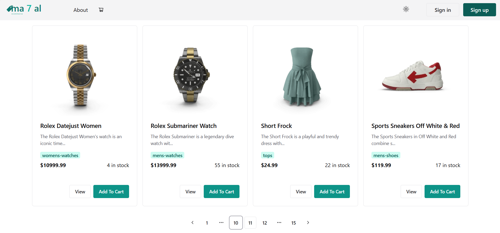

# Full Stack Ecommerce

## Live Demo

[View the deployed app on Vercel]()

This is a full-stack ecommerce web application built with React, Vite, Redux Toolkit, Chakra UI, and TypeScript. It provides a modern, fast, and scalable solution for online stores, featuring authentication, product management, cart, checkout, and admin tools.

## Features

- **Authentication**: Signup, login, logout, protected routes
- **Product Management**: Add, edit, delete, and view products
- **Category Management**: Organize products by categories
- **Cart & Checkout**: Add to cart, update quantities, checkout with payment and location forms
- **Admin Dashboard**: Manage products, categories, and users
- **Responsive UI**: Built with Chakra UI for mobile and desktop
- **Error Handling**: Custom error pages and error handling components
- **Loading States**: Skeletons and spinners for async actions
- **Form Validation**: Yup schemas for all forms
- **API Integration**: Axios for HTTP requests, RTK Query for data fetching
- **State Management**: Redux Toolkit for global state
- **Modern Tooling**: Vite for fast development, ESLint for code quality, TypeScript for type safety

## Project Structure

```
├── public/                # Static assets
├── src/
│   ├── app/               # Redux store, slices, and API services
│   │   ├── features/      # Redux slices (auth, cart, category)
│   │   ├── services/      # RTK Query API services
│   ├── assets/            # SVGs and images
│   ├── components/        # Reusable UI and feature components
│   │   ├── auth/          # Auth-related components
│   │   ├── error/         # Error handling components
│   │   ├── layout/        # Navbar, Sidebar, etc.
│   │   ├── loading/       # Loading skeletons and spinners
│   │   ├── ui/            # UI utilities (toaster, tooltip, paginator)
│   │   ├── config/        # Config files (axios, toaster)
│   │   ├── hooks/         # Custom React hooks
│   │   ├── interfaces/    # TypeScript interfaces
│   │   ├── pages/         # Page components (About, AdminDashboard, Cart, etc.)
│   │   ├── router/        # App routing
│   │   ├── services/      # Cookie service
│   │   ├── types/         # TypeScript types
│   │   ├── utils/         # Utility functions
│   │   ├── validation/    # Yup schemas
│   ├── index.css          # Global styles
│   ├── main.tsx           # App entry point
│   ├── App.tsx            # Main app component
│   ├── vite-env.d.ts      # Vite environment types
├── .env                   # Environment variables
├── package.json           # Project dependencies and scripts
├── tsconfig.json          # TypeScript configuration
├── vite.config.ts         # Vite configuration
├── eslint.config.js       # ESLint configuration
```

## Main Tools & Libraries

- **React**: UI library
- **Vite**: Build tool
- **Redux Toolkit**: State management
- **RTK Query**: Data fetching
- **Chakra UI**: Component library
- **Yup**: Form validation
- **ReactHookForm**: React Forms
- **Axios**: HTTP client
- **TypeScript**: Type safety
- **ESLint**: Linting

## Getting Started

1. Clone the repository
2. Install dependencies: `npm install`
3. Set up environment variables in `.env`
4. Start the development server: `npm run dev`

## Screenshots

Here are some screenshots of the application:





